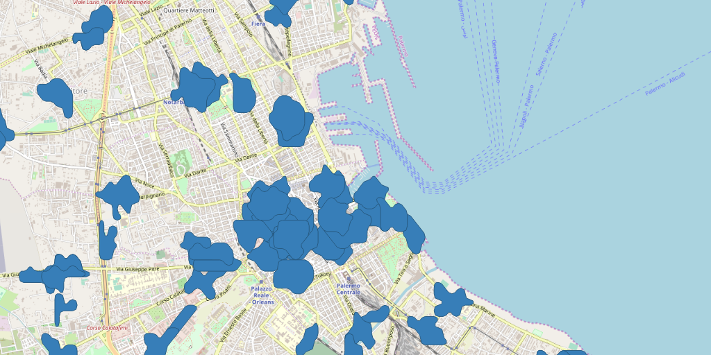

- [Introduzione](#introduzione)
- [Isolinee](#isolinee)
  - [Calcolo tramite le API di here](#calcolo-tramite-le-api-di-here)
    - [Isocrone](#isocrone)
    - [Struttura cartelle, file e schema nomi](#struttura-cartelle-file-e-schema-nomi)
      - [Schema nomi](#schema-nomi)
      - [Script](#script)
      - [File di output principali](#file-di-output-principali)

# Introduzione

In questa cartella saranno inseriti gli output di alcune analisi.

# Isolinee

Nella cartella [`isolinee`](./isolinee) si trovano gli elementi per rispondere a questo tipo di domanda:

> quali sono le **aree di Palermo** da cui si può **raggiungere** una fontanella in **10** e **5** **minuti** a **piedi**??

## Calcolo tramite le API di here

`here` mette a dispozione delle API con le quali è possibile calcolare isolinee per tempo o per distanza: <https://developer.here.com/documentation/routing/topics/example-isoline-simple-time.html>.

Per usarle è necessario creare un account; con l'[abbonamento freemium](https://developer.here.com/blog/our-here-freemium-developer-plan-in-detail) è possibile eseguire 250.000 transazioni al mese.

**Nota bene**: gli *output* delle API non sono open data, perché impogono il riuso su loro basi/prodotti (vedi sotto).


### Isocrone

Il calcolo delle isocrone - isolinee per intervalli temporali - viene fatto con una "chiamata" di questo tipo:

```
https://isoline.route.api.here.com/routing/7.2/calculateisoline.json
?app_id=XXXXXXXX
&app_code=XXXXXXXX
&mode=fastest;pedestrian;traffic:disabled
&rangetype=time
&destination=geo!37.1354,13.4521
&range=300,600
```

Alcune note:

- `app_id` e `app_code` sono delle "chiavi" di accesso, e ogni utente ha le proprie;
- con `mode` si imposta la modalità di calcolo. `fastest;pedestrian;traffic:disabled` è il percorso più rapido, fatto a piedi, senza tenere conto del traffico;
- `rangetype`, per il tipo di *range* su cui fare il calcolo. In questo caso è il tempo;
- `destination`, per impostare il punto di destinazione, per calcolare da quali aree è raggiungibile in un determinato tempo;
- `range`, per impostare gli intervalli di tempo per cui si vuole eseguire il calcolo.

L'output è in JSON. [Qui](./isolinee/rawdata/tp_001.json) un *file* di esempio.

Sono stati creati degli *script* bash ([questo](./isolinee/isolinee_a_piedi.sh) ad esempio per il calcolo del percorso a piedi) che per [ogni fontana](./isolinee/source.tsv) di acqua potabile di Palermo, calcola le aree da cui è possibile raggiungerle in [10](./isolinee/tp_600.geojson) e [5 minuti](./isolinee/tp_300.geojson) (questi sono gli output del percorso a piedi).

Qui sotto un'immagine che da un'idea dell'output:


### Struttura cartelle, file e schema nomi

I file legati a questo processo sono stati inseriti nella cartella [isolinee](./isolinee), che contiene queste sottocartelle:

- `imgs`, con immagini e file utilizzati essenzialmente per scopi descrittivi e non di analsi;
- `output`, contiene gli output principali dell'eleborazione dei dati grezzi di partenza;
- `rawdata`, contiene i file grezzi avuti in *output* dalle API di here;
- `risorse`, creata per contenere file accessori che potrebbero essere utili.

#### Schema nomi

In questo processo vengono generati diversi file, con nomi che hanno per lo più questo tipo di struttura: `ta_019_600.geojson` o `tp_300.geojson`.

Le prime due lettere sono delle sigle con questo significato:

- `tp`, per file prodotti in relazione a calcoli di isolinee **T**emporali, per percorsi **P**edonali;
- `ta`, per file prodotti in relazione a calcoli di isolinee **T**emporali, per percorsi in **A**utomobile senza tenere conto del traffico;
- `tt`, per file prodotti in relazione a calcoli di isolinee **T**emporali, per percorsi in automobile, tenendo conto del **T**raffico.

Se nel nomi ci sono due blocchi numerici, come "019" e "600 in `ta_019_600.geojson`, il primo blocco è l'identificativo della fontanella (campo `n` in [`fontanelle.csv`](./risorse/fontanelle.csv)), il secondo è il l'intervallo di tempo in secondi relativo all'analisi fatta. Se è "300", vuol dire che è un file relativo al calcolo delle aree da cui è raggiungibile una fontanella in 300 secondi (5 minuti).<br>
Se ce ne è soltanto uno come in `tp_300.geojson`, è il tempo in secondi relativo all'analisi fatta.

#### Script

Al momento sono stati creati tre script, nella cartella isolinee

- `isolinee_a_piedi.sh`, per calcolare quali sono le aree da cui le fontane sono raggiungibili a piedi in 5 e 10 minuti;
- `isolinee_auto.sh`, per calcolare quali sono le aree da cui le fontane sono raggiungibili in automobile, senza tenere conto del traffico, in 5 e 10 minuti;
- `isolinee_autoTraffico.sh`, per calcolare quali sono le aree da cui le fontane sono raggiungibili in automobile, tenendo conto del traffico, in 5 minuti;

L'ideale sarebbe unificarli e "pulirli".

Producono in output due insiemi principali: i dati grezzi nella cartella `rawdata` e i dati rielaborati a partire dai precedenti e inseriti nella cartella `output`.

#### File di output principali

Nella **radice** della cartella **isolinee** ci sono **5 file** `geojson`: costituiscono le aree da cui le fontane sono accessibili, secondo lo [schema nomi](./README.md#schema-nomi) definito sopra. Per ognuno c'è l'unione in un solo poligono, di tutti i poligoni di output di ogni fontana.


Nella cartella [`output`](./output) 5 *shapefile*, sempra con la solita struttura nomi: questi costituiscono sempre le aree da cui le fontane sono accessibili, ma c'è un poligono e un record per ogni fontana.


