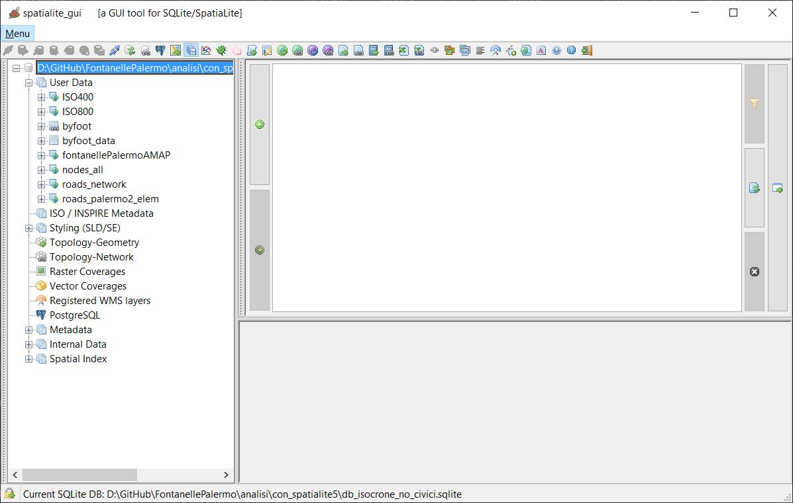
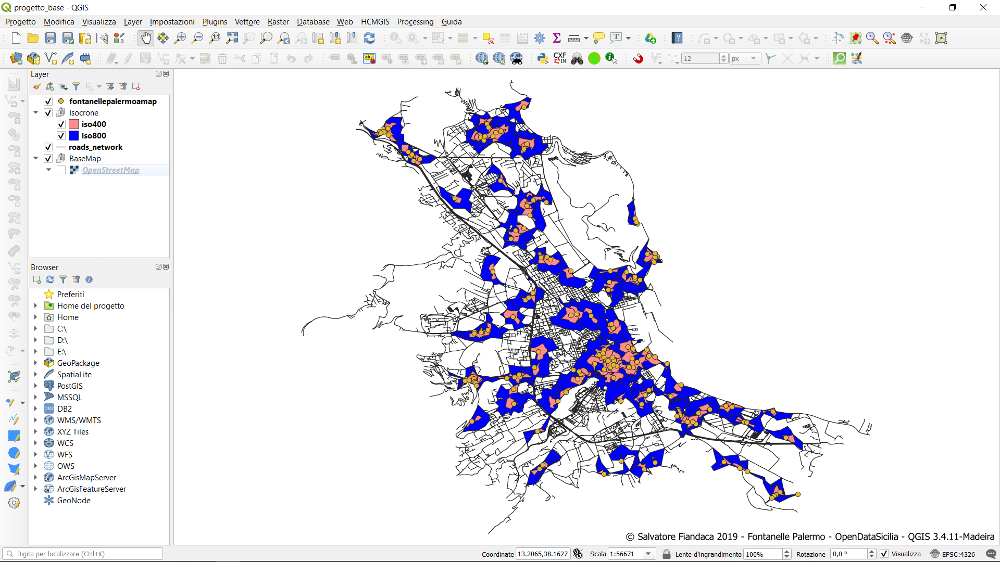

## Appunti descrittivi

**NOTA BENE**: al momento sono appunti incomprensibili

### database spatialite per Routing

In questa cartella trovi:

1. la cartalla `spatialite-5-pre-RC-20190706-win64` contiente l'eseguibile di spatialite 5 e spatialite_gui 2.1;
2. un database `db_isocrone_no_civici.sqlite` sqlite pronto per con il VirtualRouting;

#### come testarlo

1. avviare spatialite_gui presente nella cartella `spatialite-5-pre-RC-20190706-win64`
2. dal Menu → Connecting an existing SQLite DB → navigare in questa cartella e selezionate il `db_isocrone_no_civici.sqlite`;



- per isocrone

```sql
SELECT ST_ConcaveHull(ST_Collect(Geometry))
FROM byfoot
WHERE NodeFrom = 51 AND Cost <= 400.0;
```

- per shortestpath

```sql
SELECT *
FROM byfoot
WHERE NodeFrom = 51 AND NodeTo= 400
LIMIT 1;
```

### progetto QGIS



