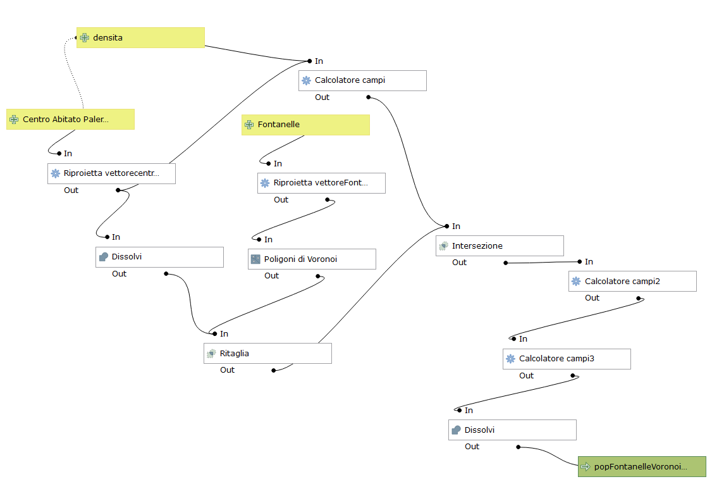

<!-- TOC -->

- [Progetto base QGIS](#progetto-base-qgis)
- [Analisi OPOD](#analisi-opod)
  - [Approssimazione quartiere](#approssimazione-quartiere)
    - [Workflow](#workflow)
    - [Output](#output)
  - [Approssimazione centro abitato quartiere](#approssimazione-centro-abitato-quartiere)
    - [Output](#output-1)
  - [Come usare i modelli di processing](#come-usare-i-modelli-di-processing)
- [Analisi densità di popolazione](#analisi-densit%c3%a0-di-popolazione)
    - [Workflow QGIS](#workflow-qgis)
    - [Output](#output-2)
    - [script SQL](#script-sql)

<!-- /TOC -->

## Progetto base QGIS

descrizione progetto ...

## Analisi OPOD

L'intero processo si basa sui poligoni di [Voronoi](https://it.wikipedia.org/wiki/Diagramma_di_Voronoi) determinati a partire dai punti fontanelle; ogni poligono rappresenterà l'area di competenza della fontanella ovvero l'insieme di tutti i punti più vicini alla fontanella stessa.

Nota la popolazione residente per ogni quartiere (anno 2018), determino uno strato **one-person-one-dot** generato dal classico processo dei **punti casuali nel poligono** (punti casuali nella distribuzione spaziale ma di numero definito); successivamnete, attraverso un altro processo molto famoso **conta punti nel poligono**, determino il numero di persone che ricadono in ogni poligono di Voronoi, questo numero rappresenterà la popolazione potenziale, ovvero, quella popolazione che per raggiungere la fontanella percorrerebbe meno spazio in linea retta.

### Approssimazione quartiere

Prima analisi con grado di approssimanione a livello di quartiere, cioè come se l'intera popolazione residente fosse equamente distribuita sull'intero quartiere.

#### Workflow

1. determino limiti amministrativi comune di Palermo dissolvendo tutto a partire dallo strato `quartieriPalermo`;
2. determino i `poligoniVoronoi`  usando lo strato fontanellePalermo;
3. ritaglio lo strato `poligoniVoronoi` con lo strato `fontanellePalermo` ottenendo `voronoiRitagliato`;
4. genero lo strato `one-person-one-dotQuartieri` puntuale utilizzando il geo-algoritmo `punti casuali dentro poligoni` a partire dallo strato `quartieriPalermo` in cui è presente un campo `sum_pop2018`(quest'ultimo ottenuto dal file csv _Palermo, popolazione residente per cittadinanza, UPL , Quartiere e Circoscrizione - 2018_ scaricato da [qui](https://data.world/gbvitrano/popolazione-residente-a-palermo-upl));
5. genero strato poligonale con geo-algoritmo `conta punti nel poligono` applicato tra lo strato `voronoiRitagliato` e lo strato `one-person-one-dotQuartieri` ottenendo lo strato poligonale `popolazione_fontanelle`;
6. genero lo strato `one-person-one-dotVoronoiFontanelle` puntuale utilizzando il geo-algoritmo `punti casuali dentro poligoni` a partire dallo strato `popolazione_fontanelle` in cui è presente un campo `pop2018`

Ho creato un modello grafico che realizza i punti sopra descritti: genera due file temporanei di output `popolazione_fontanelle`  e `one-person-one-dotVoronoiFontanelle` (occorre salvarli per conservarli nel tempo) 

PS. il modello è salvato nel progetto, cercalo tra gli strumenti di Processing gruppo `Modelli di progetto`

#### Output

### Approssimazione centro abitato quartiere

Seconda analisi con grado di approssimanione a livello di centro abitato dei quartiere, cioè come se l'intera popolazione residente fosse equamente distribuita solo nel centro abitato dei quartiere.

Il processo e il modello sono gli stessi di quello di sopra cambia solo lo strato o meglio viene considerato solo il centro abitato dei quartieri e non l'intero quartiere.

#### Output

Confronto:

### Come usare i modelli di processing

I modelli sono memorizzati nel file di progetto e sono disponibili negli strumenti di processing (Menu Processing|Strumenti)

i modelli sono due:
1. UtentiPotenzialiFontanellePalermoQuartiere
2. UtentiPotenzialiFontanellePalermoCentroAbitato

il primo è relativo alla prima analisi e il secondo alla seconda analisi.

Dopo l'avvio del modello (doppio clic) si aprirà la mascherà di sotto:

1. Selezionare il layer `fontanellePalermo`;
2. Selezionare, dal menu a tendina, il layer corrispondente al modello (in questo caso `centroabitatoquartieri`);
3. se non compilato creerà un file temporaneo (in memoria), oppure scegliere percorso per salvare il file utilizzando i tre puntini `...`;
4. se non compilato creerà un file temporaneo (in memoria), oppure scegliere percorso per salvare il file utilizzando i tre puntini `...`;

## Analisi densità di popolazione

In questa analisi prendiamo in considerazione la **densità di popolazione residente nel centro abitato**, ovvero, il rapporto tra il numero di residenti e la superficie del centro abitato.

Nota la popolazione residente per ogni quartiere (anno 2018) che ipotizzo sia la popolazione del centro abitato, determino uno strato **densitaPopVoronoi** generato dall'intersezione tra i poligoni di **Voronoi** e i poligoni del **centro abitato** (il campo `sum_pop2018` rappresenta la popolazione residente nel quartiere): prima dell'intersezione aggiungo un campo `densita` nel layer `centroAbitatoQuartieri` e lo popolo con la formula `sum_pop2018/($area/1000000)` che rappresenta la [densità di popolazione](https://it.wikipedia.org/wiki/Densit%C3%A0_di_popolazione), ovvero, la popolazione residente per ogni kmq. L'intersezione genererà più poligoni per ogni poligono di Voronoi, tanti quanti sono i poligono dei centri abitati, che erediteranno le info sulle densità di popolazione. Successivamente ogni valore di densità ereditata verrà moltiplicata per l'area del poligono (in kmq) ottenendo la popolazione potenziale per ogni poligono. Infine si dissolveranno i poligoni per riottenere i poligoni di Voronoi originali con il valore finale della popolazione potenziale.

#### Workflow QGIS

1. xxx
2. yyy

#### Output

Il risultato ottenuto è molto simile al precedente (era prevedibile) e molto più veloce nei calcoli in quanto non deve generare migliaia di punti.

PS. descriverò meglio il tutto solo se necessario.

#### script SQL

L'intero processso sopra descritto e realizzato con QGIS è stato interamente riprodotto in SQL con estensione spaziale.
Lo script `script.sql` si trova nella cartella script_SQL.