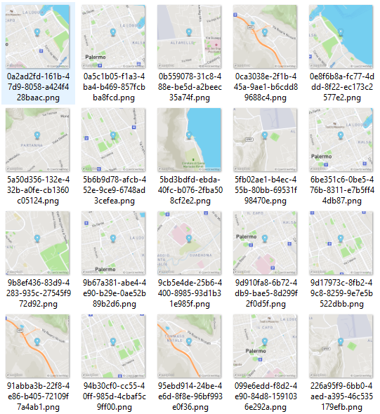

# Generatore di mappe statiche

La Google action in risposta fornisce una risposta vocale e anche un'immagine statica con la posizione della fontana.

Per generare queste immagini è stato creato uno script bash che sfrutta le [API di mapbox](https://docs.mapbox.com/help/glossary/static-images-api/) dedicate, che a partire dai dati [OpenStreetMap](https://www.openstreetmap.org), generano per ogni fontana una mappa statica a `256x256` pixel e una a `512x512`.

Lo script è il file [`staticImages.sh`](./staticImages.sh)
