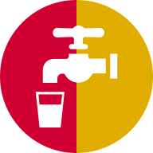

<!-- .slide: data-background="#136CE9" -->
# Fontanelle a Palermo

### Un progetto per scoprire quelle di acqua potabile

--

<!-- .slide: data-background="./imgs/mappaBase.jpg" data-background-transition="zoom" -->

## Sono 150 🧮
<!-- .element: class="fragment grow highlight-orange" -->

--

<!-- .slide: data-background="./imgs/mappaConteggiCirc.jpg" data-background-transition="zoom" data-state="tabella" -->
## Quante per circoscrizione?

--

<!-- .slide: data-background="./imgs/mappaConteggiCirc.jpg"  data-state="tabella" -->

| circoscrizione | fontanelle | residenti | residenti/ fontanella |
| --- | --- | --- | --- |
| I | 25 | 26685 | 1067 |
| VII | 39 | 78533 | 2013 |
| II | 26 | 73483 | 2826 |
| IV | 21 | 103058 | 4907 |
| III | 9 | 74825 | 8313 |
| VI | 8 | 73241 | 9155 |
| VIII | 12 | 121262 | 10105 |
| V | 10 | 114443 | 11444 |

--

<!-- .slide: data-background="#136CE9" data-state="lista" -->

# Raggiungerle

<!-- .element: class="fragment" -->
- per alcune bastano **5 minuti ⌚ a piedi**<!-- .element: class="fragment highlight-verde" -->

<!-- .element: class="fragment"  -->
- se ti piace camminare 🚶‍♀️🚶‍♂️, in **10 minuti** sono ancora di più<!-- .element: class="fragment highlight-verde grow" -->

<!-- .element: class="fragment"  -->
- da **tutta la città** almeno una in **auto** 🚗<!-- .element: class="fragment highlight-verde grow" --> in **5 minuti**<!-- .element: class="fragment highlight-verde grow" -->

--

<!-- .slide: data-background="./imgs/bottiglie.jpg" data-background-transition="zoom" data-state="titolo" -->

## Se usi una fontanella, ti prendi cura del mondo

--

<!-- .slide: data-background="#136CE9" -->

#### Se in un anno l'1% degli abitanti 🧑‍🤝‍🧑 di Palermo cambiasse abitudini

## 1.500.000 bottiglie di plastica non verrebbero consumate<!-- .element: class="fragment grow" -->

--

<!-- .slide: data-background="./imgs/goccieFontana.gif"  data-state="usala" -->

## Non fare piangere una fontanella 😢<!-- .element: class="fragment" -->

# 🙏 usala!!<!-- .element: class="fragment" -->

--

### Grazie a

  

    

      <a href="https://twitter.com/aborruso" target="_blank">Andrea Borruso</a>
    

    

      <a href="#" target="_blank">Emilio Di Gristina</a>
    

    

      <a href="https://twitter.com/totofiandaca" target="_blank">Salvatore Fiandaca</a>
    

    

      <a href="https://twitter.com/gpirrotta" target="_blank">Giovanni Pirrotta</a>
    

    

      <a href="https://twitter.com/cirospat" target="_blank">Ciro Spataro</a>
    

    

      <a href="https://twitter.com/gbvitrano" target="_blank">Gianni Vitrano</a>
    

  

