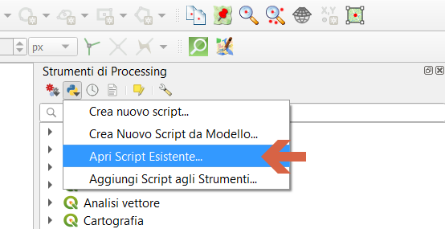

## Appunti descrittivi

**NOTA BENE**: al momento sono appunti incomprensibili

- Calcolare quante e quali fontane sono raggiungibili da un punto

[script.py](https://github.com/opendatasicilia/FontanellePalermo/files/3566324/computo_nro_iso_sovrapposte.zip)

### aggiungere script a QGIS:

